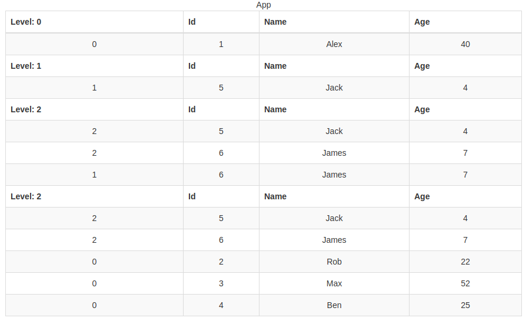

# Proof of Concept of Pivot table React component

## Requirements for table
  * Use declarative approach for component usage
  * Cells and headers should be customizable and support any content such as text, buttons, form controls etc
  * Table should support drill down functionality into more deep levels of data and each level should have:
    * Customizable styles for cells and headers
    * Separate table header for each level
    * Different visual presentation and cell content on each level

Inspired by idea of [Function as Child Components](https://medium.com/merrickchristensen/function-as-child-components-5f3920a9ace9)

```jsx
<PivotTable data={DATA}>
  <PivotTableHeaderTemplate>
    {
      ({ level }) => (
        <PivotTableHeader>
          <PivotTableHeaderCell>Level: { level }</PivotTableHeaderCell>
          <PivotTableHeaderCell>Id</PivotTableHeaderCell>
          <PivotTableHeaderCell>Name</PivotTableHeaderCell>
          <PivotTableHeaderCell>Age</PivotTableHeaderCell>
        </PivotTableHeader>
      )
    }
  </PivotTableHeaderTemplate>
  <PivotTableRowTemplate>
    {
      ({ data, level }) => (
        <PivotTableRow>
          <PivotTableRowCell>
            {level}
          </PivotTableRowCell>
          <PivotTableRowCell>
            {data.id}
          </PivotTableRowCell>
          <PivotTableRowCell>
            {data.name}
          </PivotTableRowCell>
          <PivotTableRowCell>
            {data.age}
          </PivotTableRowCell>
        </PivotTableRow>
      )
    }
  </PivotTableRowTemplate>
</PivotTable>
```

## Example

